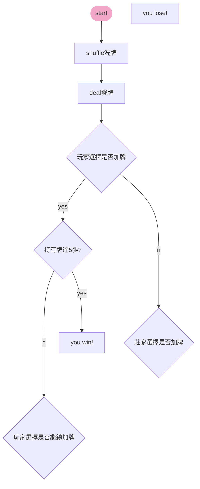

[**HackMD**](https://hackmd.io/@takedaTW/digitalExperiment)

${\rm\bf{Digital\hspace{4mm}electronics\hspace{4mm}study}}$
===

:::success
- $Author:$ [name=張呈顥]、[name=武田奈々]

:::

###### tags: `digital`、`experiment`

## :pushpin: Topic
### ==$21$點、$\rm{BlackJack}$==

## :construction_worker: Team
* **[name= 張呈顥] [u10916024]** 
* **[name= 郭子筠] [u10916028]**
* **[name=黃楷媛] [u10916032]**
* **[name=簡劭宸] [u10916041]**
* **[name=楊皓翔] [u10916035]**
* **[name=侯正成] [u10916039]**
* **[name=范圃綱] [u10916031]**
## :bookmark_tabs: Documentaion standard
### Truth table
| $a_\color{red}{i}$    |    $a_3$ |   $a_2$ |    $a_1$ |    $a_0$ |
| --------------------- |:--------:|:-------:|:--------:|:--------:|
|   $2^\color{red}{i}$  |   $8$    |   $4$   |   $2$    |   $1$    |
### Cards
:::danger
:heart: $Hearts$ :heart:

|  cards   |  A  |  2  | ... |  J  |  Q  |  K   |
| --- |:---:|:---:|:---:|:---:|:---:|:----:|
|  number   |  1  |  2  | ... | 11  | 12  | 13 |
:::

:::warning
:diamonds: $Diamonds$ :diamonds:

|  cards   |  A  |  2  | ... |  J  |  Q  |  K   |
| --- |:---:|:---:|:---:|:---:|:---:|:----:|
|  number   |  14  |  15  | ... | 24  | 25  | 26 |
:::

:::success
:clubs: $Clubs$ :clubs:

|  cards   |  A  |  2  | ... |  J  |  Q  |  K   |
| --- |:---:|:---:|:---:|:---:|:---:|:----:|
|  number   |  27  |  28  | ... | 37  | 38  | 39 |
:::

:::info
:spades: $Spades$ :spades:

|  cards   |  A  |  2  | ... |  J  |  Q  |  K   |
| --- |:---:|:---:|:---:|:---:|:---:|:----:|
|  number   |  40  |  41  | ... | 50  | 51  | 52 |
:::

:::danger
- Game  (本局)
    - win: **earn the money** :moneybag: 
    - lose:**lose the money** :money_with_wings: 
- Match (本遊戲)
    - win:  **victory** :
    - lose: **defeat**
:::
## :clipboard: The minutes
### :small_blue_diamond: 4_24 (Sun.)
- 討論主題
    1. [ ] ~~骰子~~ ==0==
    2. [ ] ~~自行輸入~~ ==1==
    3. [x] 21點 ==6==

- 摘要 
    - 規則簡介
    - 分數、分級
- 製作目的 
    - 動機
        - 喜歡玩$21$點 __[name=簡劭宸]
        - 訓練邏輯思考
- 方法探討 
    - 點數計算
        - $A$: $1$
        - $J、Q、K$: $10$
    - 分級（獲勝分數）
        - Switch 控制
        - $0$ 分 = 你輸了
        - 初始分數: $10$
        - 初階:star:
            - 贏了: ==$20$==
        - 中階:star::star:
            - 贏了:==$30$==
        - 高階:star::star::star:
            - 贏了:==$40$==
        > 還是分數改成 初始10分 階段20/30/40分 然後籌碼一次五的倍數 放電子骰子 兩個骰子一個十位數 一個個位數[name=黃楷媛 ]
    - 分數投注
        - 不可以超過目前持有的 :moneybag:
        - $5$ 的倍數
    - 過五關
        - 紀錄發牌張數
- 提出方法與步驟 
    - 依照規則畫流程圖[name=武田奈々]、[name=侯正成]
    - [$\rm{documentation}$](https://mermaid-js.github.io/mermaid/#/flowchart)
    <!--可以看這個，有語法教學-->

- 預期成果 
    - 流程
        - 發牌
        - 加注
            - 判斷持有金額
        - 是否加牌
            - 莊家小於$11$須加牌至超過
        - 決戰
            - 對未有爆牌的玩家，比點數大小，大者勝，可得賠金（根據加注金額）
            - 如莊家爆牌、未有爆牌的玩家便可得賠金
    - 顯示
        - 分數 放骰子(十位數/個位數)
        - 牌號 放七段顯示器(左2玩家/右2莊家)
        - 累加牌號 放8*8(上半玩家/下半莊家
:::danger
#### 企劃書草稿截止日:==$\hspace{2mm}4/26 \hspace{2mm} _{A.M.} \hspace{0.5mm} 00:00\hspace{2mm}$==
:::
### :small_blue_diamond: 4_27 Teacher meeting (Wed.)
- 太複雜
- LED
    - 點數
- 確認按鈕
- 比較大小
- 呈現贏跟輸就好
- 自動加牌的狀態
    - 過程
- 亂數產生器棒

## :ballot_box_with_check: TODO
- [x] find the topic
- [ ] write the proposal
    - **統一整合與規劃** [name=張呈顥]
        - **一、 摘要** [name=楊皓翔]
        - **二、 製作目的** [name=郭子筠]
        - **三、 方法探討** [name=簡劭宸]
        - **四、 提出方法及步驟** [name=侯正成]、[name=范圃綱]
        - **五、 預期成果** [name=黃楷媛]

      

